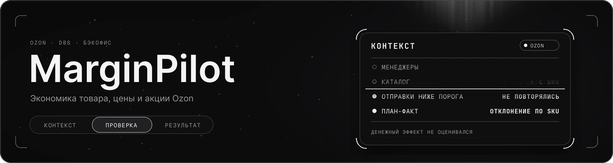
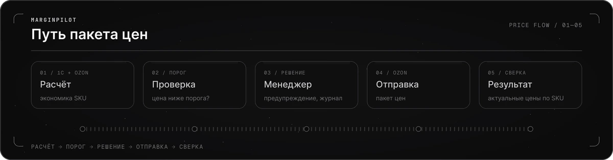

MarginPilot — внутренняя бэкофис-система для оценки экономики SKU, изменения цен и управления акциями в кабинете Ozon.

[Читать единый кейс MarginPilot](case-marginpilot.md) · [Открыть интерактивный прототип](prototype/dist/index.html) · [Артефакты](prototype/dist/artifacts.html) · [Карта документов](prototype/dist/documents.html) · [Скачать PDF](output/pdf/case-marginpilot.pdf)

## 

С MarginPilot работали **три менеджера по продажам**. Они управляли каталогом примерно из **3600 SKU** в **двух кабинетах Ozon**. В кейсе подробно разобрана схема DBS.

После изменения комиссий или тарифов менеджеры пересчитывали цены в рабочей книге и загружали их в Ozon. Вместе с проверкой результата это занимало **1–4 часа**. Однажды ошибка в шаблоне привела к массовой отправке заниженных цен: часть товаров успела продаться до обнаружения ошибки. Так появилась ключевая задача MarginPilot — проверять экономику цены до отправки.

## 

Я собирал требования и проектировал функции MarginPilot как бизнес- и системный аналитик.

| Задача | Мой вклад | Зачем это было нужно | Результат |
| --- | --- | --- | --- |
| Снизить риск заниженных цен | Описал порог и предупреждение; SKU ниже порога включались в пакет только вручную. | Проверять пакет до отправки, сохранив право менеджера на исключение. | Случайные массовые отправки ниже порога после внедрения не повторялись. |
| Разбирать ценовые ошибки | Определил состав журнала: пользователь, время, кабинет, SKU и решение по цене ниже порога. | Восстанавливать ход отправки при инциденте. | Состав пакета и подтверждённые исключения можно было найти по записям. |
| Применять и проверять изменения | Разделил ответ API и фактический результат; описал сверку по SKU и обработку таймаута. | Не принимать отправку за успешное применение в Ozon. | Полный цикл: 1–4 часа → 10–20 минут; проверка цены: 6 → 2 действия. |
| Сопоставлять план и факт | Описал снимок расчёта и выбор версии плана на момент продажи. | Не подменять исторический план последним расчётом. | Менеджер видел отклонение по SKU и фактические расходы, включая рекламу. |

Размеры пакетов различались, поэтому единый процент ускорения не рассчитывался. Период наблюдения за инцидентами не зафиксирован; денежный эффект не оценивался.

## 

На данных 1С и Ozon MarginPilot оценивал **результат одной продажи SKU** при рассматриваемой цене. Спрос и будущий объём продаж система не прогнозировала.

## 

<table>
  <tr>
    <td width="50%" align="center"> До: ручная подготовка и проверка цен</td>
    <td width="50%" align="center"> После: проверка порога до отправки</td>
  </tr>
</table>

- [Контейнерная диаграмма C4](assets/c4-container-marginpilot.svg).
- [ER-диаграмма проектной базы данных](assets/database-schema.png).
- [Состояния пакета и результата по SKU](assets/state-batch-sku.svg).

## 

### Бизнес-анализ

- [Бизнес-процессы: до и после внедрения](02-PROCESS-AS-IS-TO-BE.md)
- [Функциональные требования](03-FUNCTIONAL-REQUIREMENTS.md)
- [Бизнес-метрики и результаты](04-RESULTS.md)
- [Ограничения и зависимости](05-CONSTRAINTS-DEPENDENCIES.md)
- [Риски и меры снижения](06-RISKS-MITIGATION.md)
- [Стейкхолдеры](07-STAKEHOLDERS.md)
- [Успех проекта](08-PROJECT-SUCCESS.md)
- [Планы расширения](09-EXPANSION-PLANS.md)

### Системный анализ

- [Архитектура системы: контейнерная диаграмма C4](01-SYSTEM-ARCHITECTURE.md)
- [Use Cases: цены, акции и план-факт SKU](10-USE-CASES.md)
- [Нефункциональные требования](11-NON-FUNCTIONAL-REQUIREMENTS.md)
- [Критерии приёмки](16-ACCEPTANCE-CRITERIA.md)

### Технические приложения

- [Backend-логика](12-BACKEND-LOGIC.md)
- [HTTP-контракт внутреннего API (реконструкция)](13-HTTP-CONTRACT.md)
- [Проектная схема БД (DBML)](14-DATABASE-SCHEMA.dbml)
- [OpenAPI-спецификация внутреннего API (реконструкция)](15-OPENAPI.json)

## 

### Модели и контракты

    

### API и данные

  

OpenAPI реконструирован для кейса; SwaggerHub используется для публикации спецификации. Примеры для портфолио обезличены.
