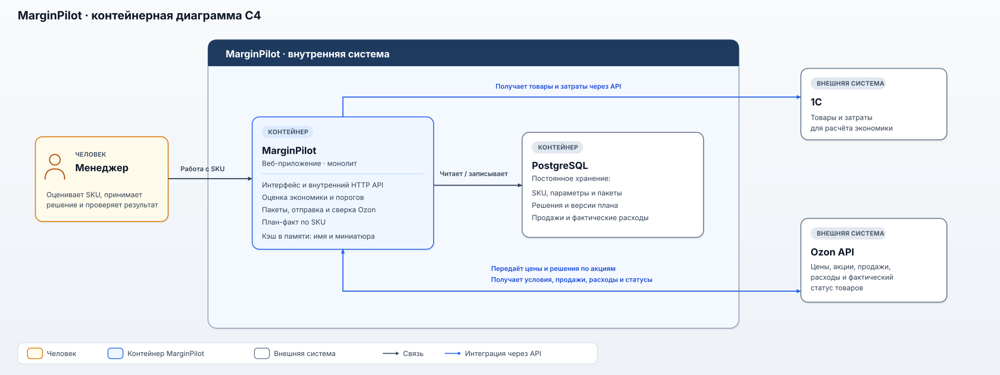

# MarginPilot: управление ценами и акциями Ozon на уровне SKU

## 1. Кейс за минуту

MarginPilot — внутренняя бэкофис-система, в которой менеджеры оценивали экономику товара перед изменением цены или участием в акции Ozon. Система отправляла решения через API, проверяла фактически применённое состояние и помогала сопоставлять плановую экономику с результатами продаж. В этом кейсе подробно разобран контур DBS.

С системой работали три менеджера в двух кабинетах Ozon: двое занимались DBS, один — FBO. В каталоге было около 3600 SKU. До внедрения пересчёт и загрузка цен опирались на рабочую книгу и шаблон Ozon. Ошибка в шаблоне однажды привела к массовой отправке заниженных цен — часть товаров успела продаться до обнаружения проблемы.

Моя роль — бизнес- и системный анализ: я собирал требования и проектировал функции, которые связывали расчёт экономики, решение менеджера, отправку изменений и проверку результата. В частности, описал предупреждение для цен ниже экономического порога, осознанное включение таких SKU в пакет и запись решения в журнал. Ответ API при этом не считался доказательством, что цена или участие в акции действительно изменились: система отдельно сверяла результат с Ozon.

После внедрения полный цикл изменения цен — от пересчёта до проверки применённых цен — занимал **10–20 минут вместо 1–4 часов** при пакетах разного размера. Проверка цены требовала **двух ручных действий вместо шести**. Случайные массовые отправки цен ниже порога не повторялись, но период наблюдения не зафиксирован. Подтверждённых сумм предотвращённого ущерба нет, поэтому финансовый эффект в деньгах здесь не заявлен.

Кейс основан на реализованном рабочем процессе. Диаграммы архитектуры, проектная модель БД и внутренний API реконструированы для портфолио, а не представлены как выгрузка исходной документации. Примеры обезличены; рабочая книга и внутренние цены не публикуются.

## 2. Проблема и процесс AS IS (до внедрения)

### Как менеджеры меняли цены

Поводом для пакетного пересчёта часто становилось изменение комиссии Ozon или тарифа. Менеджер выбирал затронутые товары, обновлял расчёт в рабочей книге и готовил шаблон для загрузки цен. После отправки файла нужно было убедиться, что площадка применила ожидаемые значения.

[Открыть BPMN в полном размере](assets/bpmn-bp01-as-is.svg). Схема составлена для кейса по подтверждённому порядку работы; она показывает основной путь одного пакета, а не каждое действие в таблице.

Сверка тоже оставалась ручной: менеджер заходил в Ozon, находил и скачивал выгрузку актуальных цен, вставлял её в рабочую книгу, обновлял формулы и проверял расхождения. Вместе с пересчётом и загрузкой это занимало от одного до четырёх часов. Размер пакета менялся от случая к случаю: изменение тарифа могло затронуть гораздо больше SKU, чем локальная корректировка.

### Где процесс давал сбой

Рабочая книга и шаблон связывали расчёт с массовой отправкой, но ошибка внутри шаблона могла пройти вместе со всем пакетом. Так произошло в одном из случаев: множество товаров получили слишком низкие цены, и часть из них продалась до обнаружения ошибки. Размер ущерба в кейсе не раскрывается.

Проверка после загрузки могла обнаружить занижение, но не защищала от продаж между отправкой и обнаружением ошибки. Поэтому ключевым изменением стал **контроль экономического порога до отправки**. При этом решение отправить цену ниже порога не запрещалось полностью: менеджеру требовалась возможность осознанно подтвердить исключение.

## 3. Моя роль, цели и границы системы

### За что я отвечал

Я совмещал задачи бизнес- и системного аналитика: собирал требования, разбирал работу менеджеров и переводил её в проверяемые правила для MarginPilot. Три решения хорошо показывают мою зону ответственности:

- Описал проверку экономического порога до отправки: предупреждение, ручное включение SKU ниже порога и запись такого решения в журнал.
- Разделил ответ Ozon на отправку и подтверждение фактического результата; предусмотрел сверку по SKU и обработку таймаута без слепой повторной отправки.
- Определил, что для план-факта нужно сохранять исходные значения расчёта и выбирать версию плана, действовавшую на момент продажи.

Для портфолио эти решения оформлены в процессных схемах, Use Cases, требованиях и технических моделях; ссылки собраны в конце документа.

### Какие задачи решала система

Задача MarginPilot — сокращать время пакетного изменения цен и снижать риск ошибки до публикации цены. Менеджеру требовалось видеть экономику предлагаемой цены, отдельно замечать SKU ниже порога и понимать, что именно Ozon применил после отправки. После продаж плановый расчёт служил точкой сравнения с фактическими результатами и расходами, включая рекламу.

### Что входило в границы

В этом разборе показан путь Ozon DBS: данные о товарах и затратах поступают из 1С, условия продажи и фактическое состояние — из Ozon; MarginPilot рассчитывает экономику одной продажи SKU, поддерживает изменение цен и участие в акциях, автоматически сверяет результат и показывает план-факт. 1С и Ozon остаются внешними по отношению к MarginPilot системами.

Ценовое решение принимал менеджер. Система предупреждала о цене ниже порога, но не запрещала её отправку после явного выбора и не меняла цены самостоятельно. Расчёт оценивал будущую экономику **одной продажи при заданных условиях**, а не спрос или будущий объём продаж. Работа по FBO и другим маркетплейсам в сквозной сценарий кейса не включена.

## 4. Процесс TO BE (после внедрения)

Изменение комиссии или тарифа по-прежнему требовало пересмотреть цены. Изменился путь от расчёта до результата: менеджер готовил решение в MarginPilot, а система проверяла его до отправки и сама сверяла с Ozon после неё.

[Открыть BPMN в полном размере](assets/bpmn-bp01-to-be.svg). На схеме менеджер и MarginPilot разделены по дорожкам; 1С и Ozon показаны как внешние участники обмена.

1. MarginPilot получает данные из 1С и Ozon и показывает расчёт экономики для выбранных SKU. Менеджер задаёт предлагаемые цены и отмечает товары для отправки.
2. Перед отправкой система сравнивает каждую выбранную цену с экономическим порогом. Если все цены допустимы, пакет уходит после нажатия «Загрузить цены». Если есть цены ниже порога, открывается предупреждение: такие SKU перечислены отдельно и **не отмечены по умолчанию**.
3. Менеджер может отменить весь пакет либо вручную включить отдельные SKU ниже порога и подтвердить отправку. MarginPilot сохраняет состав пакета, автора и подтверждённые исключения, затем передаёт цены в Ozon через API.
4. Ответ Ozon обрабатывается по каждому SKU, но не считается окончательной проверкой. MarginPilot автоматически запрашивает актуальные цены, сравнивает их с отправленными и обновляет страницу результата. Менеджер может открыть её, пока пакет ещё обрабатывается, и затем увидеть итог по позициям.

Если Ozon не ответил вовремя, исход отправки остаётся неизвестным. MarginPilot показывает это менеджеру и продолжает **проверять актуальные цены**, в том числе позже для непроверенных SKU. Сам пакет из-за таймаута повторно не отправляется: повтор мог бы наложиться на изменение, которое Ozon уже принял.

Так предупреждение работает до публикации цены, а сверка — после неё. Решение об исключении остаётся за менеджером; получение данных, отправка и проверка результата выполняются системой.

## 5. Один SKU: от расчёта до план-факта

Ниже — иллюстративный путь товара `SKU-DEMO-01` в кабинете DBS. Артикул и суммы вымышлены; последовательность действий и правила проверки соответствуют реализованным функциям. Экономический порог — рассчитанная минимально допустимая цена одной продажи с учётом затрат и принятой ценовой политики.

1. **Оценка цены.** После изменения комиссии MarginPilot обновляет данные из 1С и Ozon. Для выбранного SKU система учитывает себестоимость, комиссию, тариф, логистику, расходы на отзывы и плановые затраты на рекламу. В этом примере экономический порог равен **1 250 ₽**: при более низкой цене расчёт не даёт допустимого результата для одной продажи.
2. **Предупреждение до отправки.** Менеджер предлагает цену **1 190 ₽**, выбирает SKU и нажимает «Загрузить цены». MarginPilot показывает этот артикул в панели предупреждения; чекбокс включения в пакет пустой. Менеджер нажимает «Отмена». Панель закрывается, запрос в Ozon не уходит.
3. **Новое решение.** Менеджер пересматривает цену до **1 290 ₽** и снова запускает отправку. Цена выше порога, поэтому дополнительное подтверждение не требуется. MarginPilot сохраняет пакет и исходные значения расчёта, затем передаёт изменение в Ozon через API.
4. **Проверка результата.** Получив ответ на отправку, MarginPilot автоматически читает актуальную цену SKU в Ozon. Только после совпадения с **1 290 ₽** изменение считается подтверждённым и сохраняется новая версия плана. Менеджер открывает страницу результата и видит итог по этому артикулу; обновлять данные вручную ему не нужно.
5. **Отдельное решение об акции.** Позже менеджер рассматривает тот же SKU для акции Ozon и указывает цену входа **1 270 ₽**. Прежняя цена **1 290 ₽** отображается зачёркнутой. Цена входа выше порога, поэтому предупреждение не требуется. MarginPilot передаёт решение в Ozon и автоматически проверяет статус участия. После подтверждённого входа в акцию сохраняется ещё одна версия плана.
6. **План и факт.** Менеджер выбирает SKU и период продаж. MarginPilot сопоставляет каждую продажу с версией плана, действовавшей в её момент, добавляет фактические расходы за период и показывает отклонение `факт − план` в сумме и на проданную единицу. Так продажи до входа в акцию не оцениваются по более позднему плану. Результат помогает менеджеру принять следующее ценовое решение.

Если бы менеджер решил отправить исходные **1 190 ₽**, он должен был вручную отметить SKU в предупреждении и подтвердить пакет. MarginPilot сохранил бы это исключение в журнале с пользователем, временем, кабинетом и артикулом. Такой путь был разрешён, но не мог возникнуть из-за одного лишь нажатия «Загрузить цены».

## 6. Решения, определившие поведение системы

### Предупреждение вместо полного запрета

Цена ниже экономического порога не отправлялась незаметно: MarginPilot выводил такие SKU в отдельную панель, а чекбоксы в ней оставались пустыми. Менеджер мог исключить позиции или осознанно включить их в пакет. В последнем случае система сохраняла, кто, когда и для какого SKU подтвердил решение. Это снижало риск случайной массовой отправки, но не устраняло риск намеренного выбора невыгодной цены — ответственность за него оставалась у менеджера.

### Ответ на отправку и фактический результат — разные вещи

Ozon мог принять запрос, отклонить отдельные позиции или не ответить вовремя. Поэтому MarginPilot показывал результат отправки по SKU и отдельно считывал применённую цену либо статус участия в акции. При таймауте система не делала вывод, что действие не выполнено: она сохраняла неопределённый результат и продолжала чтение актуального состояния. Пакет цен не отправлялся повторно автоматически; для акции повтор того же действия по SKU был закрыт до выяснения результата. Это защищало от дублирования изменения, которое Ozon уже мог применить.

### Цена товара и цена входа в акцию — разные решения

Для добавления SKU в акцию менеджер указывал отдельную цену входа; прежняя цена отображалась как старая, зачёркнутая. Именно цену входа MarginPilot сравнивал с экономическим порогом. При выходе из акции прежнюю цену восстанавливал Ozon, поэтому MarginPilot не формировал дополнительный пакет цен. После каждого действия система проверяла фактический статус участия, а не полагалась только на ответ о приёме запроса.

### Исторический план нельзя заменять текущим

MarginPilot сохранял исходные значения расчёта, а после подтверждённого изменения цены или участия в акции — новую версию плана. При анализе продаж каждой продаже соответствовала версия, действовавшая в её момент. Иначе поздний пересчёт исказил бы сравнение прошлых решений с фактом. Плановый рекламный расход на продажу учитывался отдельно от фактических списаний; если продаж не было, расходы оставались видны, но показатель на проданную единицу не вычислялся.

## 7. Архитектура, интеграции и данные

### Где проходили границы системы

Менеджер работал в веб-интерфейсе MarginPilot. Приложение было монолитом: в его границах находились расчёт экономики, подготовка пакетов, отправка изменений, сверка результата и план-факт. PostgreSQL хранил данные, которые нужны между запросами и после завершения отправки. 1С и Ozon оставались внешними системами, с которыми MarginPilot обменивался данными.

[Открыть C4-схему в полном размере](assets/c4-container-marginpilot.svg). Это реконструкция уровня контейнеров по подтверждённым функциям и интеграциям, а не схема исходного развёртывания. Кэш названий и миниатюр на схеме — проектное дополнение; его наличие в работавшей системе не подтверждено.

### Что поступало через интеграции

Из 1С MarginPilot получал сведения о товарах и затратах для расчёта. Из Ozon — текущие цены, комиссии и тарифы, условия акций, продажи, рекламные расходы и фактическое состояние после изменений. В обратную сторону через Ozon API передавались пакеты цен и решения о добавлении или удалении товаров из акций. Чтение применённого состояния было отдельным шагом: успешный ответ на отправку его не заменял.

### Что сохранялось и зачем

| Данные | Для чего они нужны |
| --- | --- |
| Товар и кабинет Ozon | Не смешивать решения и результаты для одинаковых артикулов в разных кабинетах. |
| Исходные значения расчёта и версии плана | Восстановить экономику, на основании которой принималось решение, и сравнить продажи с планом своего времени. |
| Пакет, результат по SKU и журнал исключений | Разобрать, что отправили, что применилось и кто подтвердил цену ниже порога. |
| Продажи и фактические расходы | Рассчитать план-факт за период, в том числе с учётом рекламы. |

PostgreSQL использовался для хранения этих данных. При этом имена таблиц, ключи и связи в [проектной модели БД](14-DATABASE-SCHEMA.dbml) реконструированы для кейса. По той же причине [внутренний HTTP-контракт](13-HTTP-CONTRACT.md) описывает поведение интерфейса и сервера в реконструкции, но не выдаётся за оригинальную спецификацию API.

## 8. Результаты и ограничения измерения

После внедрения менеджеры тратили меньше времени на изменение цен и меньше ручных действий на проверку. Для сравнения использованы два показателя с разными границами:

| Показатель | Что считаем | AS IS | TO BE |
| --- | --- | --- | --- |
| Сквозное время изменения цен | От начала пакетного пересчёта до проверки применённых цен | 1–4 часа | 10–20 минут |
| Ручные действия при проверке цены | От открытия источника результата до проверки цены по SKU | 6 действий | 2 действия: открыть результат в MarginPilot и проверить его |

Во втором показателе менеджер выполнял на четыре действия меньше — примерно на **67%**. Это сокращение числа действий, а не измерение времени самой проверки. Для полного цикла единый процент ускорения не рассчитывается: пакеты до и после внедрения различались по размеру.

Проверка порога перенесла обнаружение опасной цены на этап **до отправки**. Случайные массовые отправки ниже порога после внедрения не повторялись. Однако период наблюдения не зафиксирован, поэтому это наблюдение нельзя превращать в показатель частоты инцидентов. Риск также не исчез полностью: менеджер мог вручную подтвердить цену ниже порога.

Финансовый эффект остаётся качественным. Известен сам инцидент с ущербом и механизм снижения риска, но нет подтверждённых сумм потерь, предотвращённого ущерба или затрат на систему. ROI и прирост прибыли в этом кейсе не заявляются.

## 9. Статус сведений и материалы кейса

### Как читать утверждения

| Статус | Что к нему относится |
| --- | --- |
| Подтверждено опытом участника проекта | Работа MarginPilot, интеграции с 1С и Ozon, предупреждение и журнал решений, автоматическая сверка, план-факт, рабочий масштаб и приведённые диапазоны времени. Это сведения о практике, а не независимый аудит исходной системы. |
| Расчёт и иллюстрация | Сокращение ручных действий на 67% получено из подтверждённых чисел «6» и «2». Артикул и цены в разделе 5 вымышлены; они показывают правило сравнения с порогом, а не реальные товары или результаты расчёта. |
| Реконструкция для портфолио | BPMN и C4 оформляют подтверждённые процессы и интеграции. DBML, SQL-примеры, внутренний HTTP-контракт и OpenAPI показывают проектное представление решения, а не копию исходной реализации. |
| Предложения по развитию | Контроль свежести данных, проверка сопоставления SKU и адаптация подхода к другим маркетплейсам описаны как дальнейшие возможности, не как внедрённые функции. |

### Где смотреть подробности

- **Кейс и интерфейс в одном прототипе:** [интерактивная страница MarginPilot](prototype/dist/index.html). Поиск по каталогу, оценка цены, управление акцией и план-факт собраны на одном рабочем экране. Демо использует вымышленные данные и не отправляет запросы в 1С или Ozon.
- **Процесс и результат:** [AS IS / TO BE и другие BPMN](02-PROCESS-AS-IS-TO-BE.md), [метрики](04-RESULTS.md), [риски и меры снижения](06-RISKS-MITIGATION.md).
- **Поведение системы:** [функциональные требования](03-FUNCTIONAL-REQUIREMENTS.md), [Use Cases](10-USE-CASES.md), [нефункциональные требования](11-NON-FUNCTIONAL-REQUIREMENTS.md), [критерии приёмки](16-ACCEPTANCE-CRITERIA.md).
- **Архитектура и контракт:** [C4 и границы системы](01-SYSTEM-ARCHITECTURE.md), [backend-логика](12-BACKEND-LOGIC.md), [HTTP-контракт](13-HTTP-CONTRACT.md), [DBML](14-DATABASE-SCHEMA.dbml), [OpenAPI](15-OPENAPI.json).
- **Бизнес-контекст и развитие:** [зависимости](05-CONSTRAINTS-DEPENDENCIES.md), [стейкхолдеры](07-STAKEHOLDERS.md), [критерии успеха](08-PROJECT-SUCCESS.md), [планы расширения](09-EXPANSION-PLANS.md).
