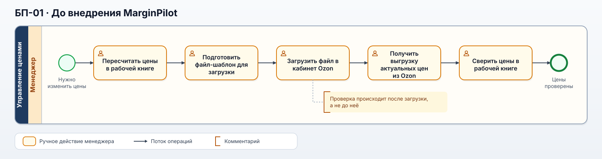
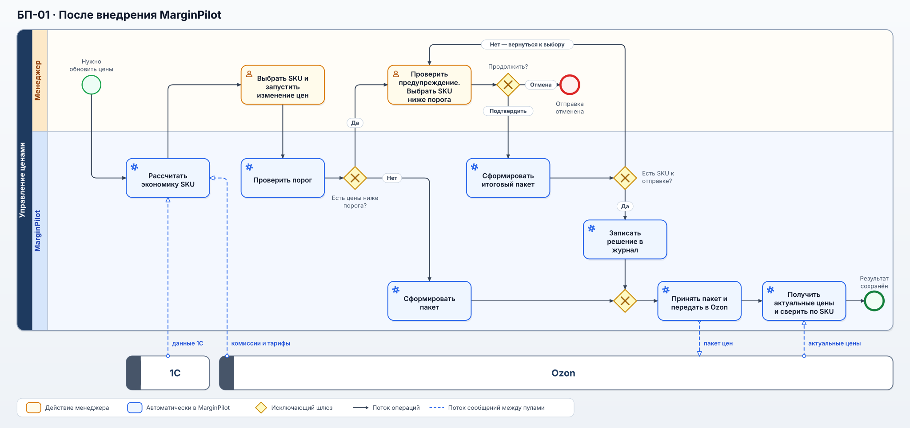
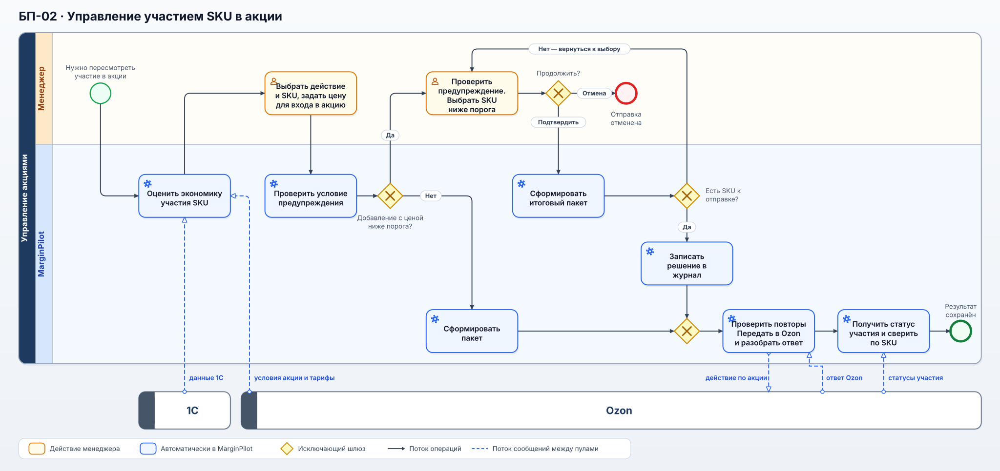
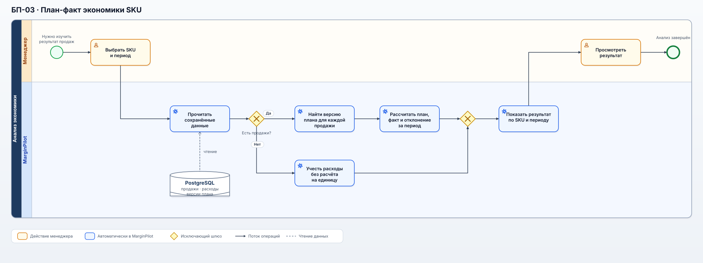

# Бизнес-процессы: до и после MarginPilot

Для изменения цен показан процесс до и после внедрения. Управление акциями и план-факт описаны только для MarginPilot: прежние процессы по ним в кейсе не реконструируются. Расчёт относится к Ozon DBS.

## Карта процессов

| Код | Процесс | Тип | Результат |
| --- | --- | --- | --- |
| БП-01 | Подготовка и применение цен | Основной | Согласованные цены переданы в Ozon и проверены после применения |
| БП-02 | Управление участием SKU в акции | Основной | Решение принято с учётом прогнозной экономики, передано в Ozon и сверено с фактическим статусом |
| БП-03 | План-факт экономики SKU | Основной | Менеджер видит отклонение фактического результата от прогноза |
| ВП-01 | Обеспечение исходными данными | Вспомогательный | Для расчёта и анализа доступны данные 1С и Ozon |
| ВП-02 | Учёт решений после предупреждения | Вспомогательный | Сохранён след подтверждения пакета после предупреждения |

## До внедрения

### BPMN: БП-01 до внедрения

[Открыть схему в полном размере](../assets/bpmn-bp01-as-is.svg) · [Редактируемая BPMN-модель](../assets/bpmn-bp01-as-is.bpmn). На схеме показан основной путь одного пакета цен; подробные действия при ручной сверке перечислены ниже.

После изменения комиссий или тарифов Ozon менеджеры пересчитывали цены в рабочей книге, готовили файл для загрузки и затем проверяли цены на площадке. На это уходило **от 1 до 4 часов**. Срок зависел от размера пакета: каталог насчитывал около 3600 SKU, но не каждый пересчёт затрагивал их все.

Однажды ошибка в шаблоне привела к массовому занижению цен. Пока её обнаружили, часть товаров продалась с существенным ущербом. Проверка после загрузки не могла предотвратить такие продажи — поэтому в MarginPilot цены стали проверять **до** отправки.

Ручная проверка применённых цен состояла из шести действий: зайти на площадку, найти выгрузку актуальных цен, скачать её, вставить данные в таблицу, обновить формулы и проверить цены.

## БП-01. Подготовка и применение цен после внедрения

### BPMN: БП-01 после внедрения

[Открыть схему в полном размере](../assets/bpmn-bp01-to-be.svg) · [Редактируемая BPMN-модель](../assets/bpmn-bp01-to-be.bpmn). Менеджер и MarginPilot показаны в отдельных дорожках, 1С и Ozon — в отдельных пулах. Страницу результата можно открыть, пока система отправляет пакет и сверяет цены. Ветки предупреждения и ошибок подробно описаны в [UC-001](10-USE-CASES.md).

После изменения комиссии или тарифа MarginPilot получает данные из 1С и Ozon и рассчитывает экономику выбранных SKU. Менеджер готовит пакет цен. Если цена ниже порога, система предупреждает об этом до отправки; менеджер решает, какие из таких позиций включить в пакет. После отправки MarginPilot читает актуальные цены в Ozon и показывает результат по каждому SKU. Даже при таймауте ответа повторяется проверка состояния, а не отправка того же пакета.

Предупреждение не было запретом: решение отправить цену ниже порога оставалось за менеджером. Система сохраняла автора и время пакета, а также отдельно отмечала вручную включённые позиции ниже порога. Полный цикл занимал **10–20 минут** вместо **1–4 часов** до внедрения.

## БП-02. Управление участием SKU в акции

[Открыть схему в полном размере](../assets/bpmn-bp02-promotion.svg) · [Редактируемая BPMN-модель](../assets/bpmn-bp02-promotion.bpmn). Ветки предупреждения и ошибок описаны в [UC-002](10-USE-CASES.md).

Менеджер выбирает товары и оценивает участие в акции при отдельной цене входа. MarginPilot предупреждает о цене ниже порога при добавлении товара, но не при выходе из акции. Принятое решение система передаёт в Ozon и затем автоматически сверяет статус участия. Пока исход действия неизвестен, тот же запрос по товару не отправляется повторно.

Изменение цены и участие в акции связаны, но это разные действия в Ozon. При выходе из акции прежнюю цену восстанавливает Ozon; MarginPilot не отправляет отдельный пакет цен для её восстановления.

## БП-03. План-факт экономики SKU

[Открыть схему в полном размере](../assets/bpmn-bp03-plan-fact.svg) · [Редактируемая BPMN-модель](../assets/bpmn-bp03-plan-fact.bpmn). При открытии анализа MarginPilot читает сохранённые данные из PostgreSQL; порядок расчёта раскрыт в [UC-003](10-USE-CASES.md).

Менеджер выбирает SKU и период. MarginPilot сопоставляет продажи с версиями плана, действовавшими в момент каждой продажи, и сравнивает план с фактическими расходами. Менеджер видит отклонение за период и на проданную единицу, чтобы учесть его в следующем решении.

Плановый рекламный расход на одну продажу и фактическое рекламное списание учитываются отдельно: расход на клики может возникнуть и без продажи. Если продаж за период не было, фактические расходы остаются видны, а показатель на проданную единицу не рассчитывается.

Отклонение считают как `факт − план`: для прибыли значение выше нуля означает превышение плана, для расходов — перерасход.

## Вспомогательные процессы

**ВП-01. Обеспечение исходными данными.** MarginPilot получает из 1С и Ozon данные для расчёта цен и план-факт анализа. Само ценовое решение принимается в БП-01 или БП-02.

**ВП-02. Учёт решений после предупреждения.** MarginPilot сохраняет, кто продолжил отправку, и отдельно фиксирует вручную включённые SKU ниже порога. Эти записи помогают разобрать ценовую ошибку.
