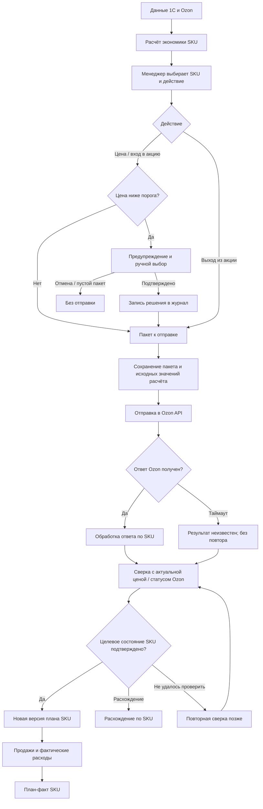
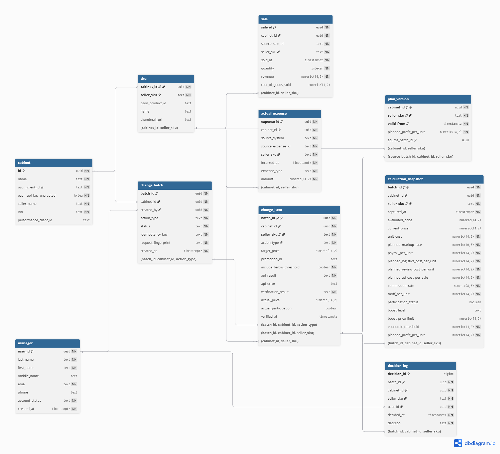
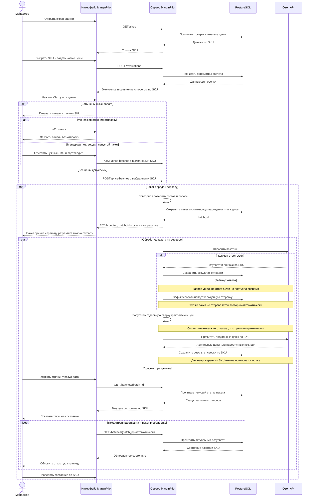
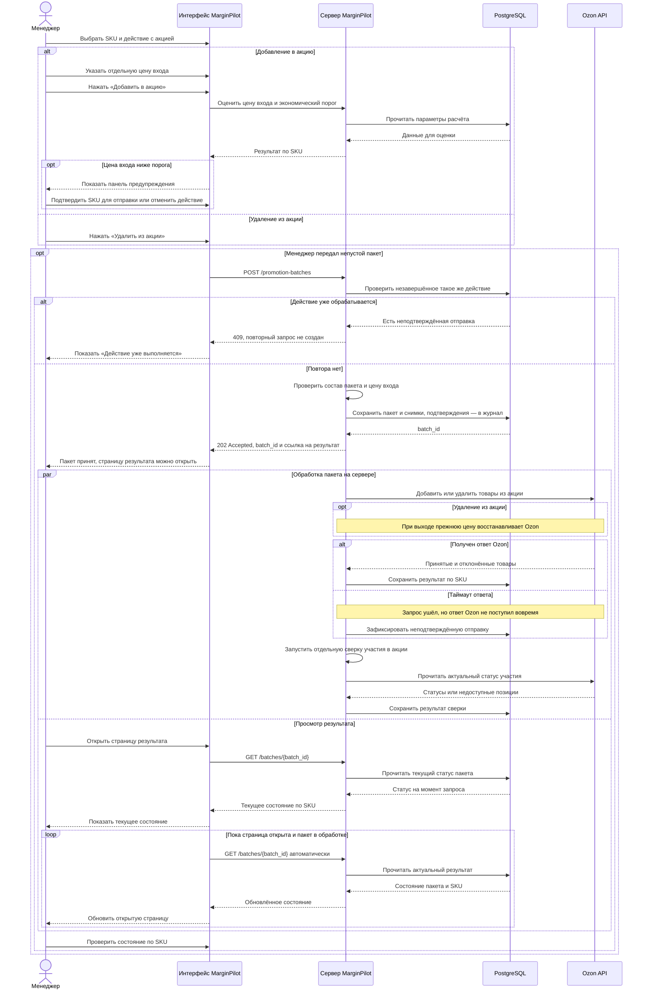
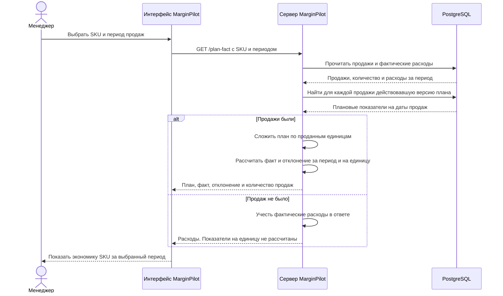

# Backend-логика MarginPilot

[Контейнерная диаграмма C4 и границы системы](01-SYSTEM-ARCHITECTURE.md).

## 1. Общий обзор

### Назначение

Серверная часть MarginPilot связывала данные 1С и Ozon с действиями менеджера: рассчитывала экономику продажи SKU, проверяла ценовые решения до отправки, передавала их в Ozon и сверяла фактический результат. После продаж она сопоставляла плановую и фактическую экономику. Расчёт оценивал результат одной продажи при заданной цене, а не будущий спрос.

### Высокоуровневая логика

1. **Получение данных.** MarginPilot получал из 1С и Ozon данные, необходимые для расчёта экономики выбранных SKU, работы с ценами и акциями.
2. **Оценка решения.** Для предложенной цены система рассчитывала экономику продажи и сравнивала цену с экономическим порогом. Участие в акции оценивалось с учётом отдельной цены входа.
3. **Контроль перед отправкой.** При цене ниже порога система показывала предупреждение. В отправку попадали допустимые SKU и только те позиции ниже порога, которые менеджер подтвердил вручную; его решение сохранялось в журнале.
4. **Отправка и сверка.** MarginPilot передавал пакет в Ozon через API, обрабатывал ответ по SKU и проверял применённую цену или статус участия. Если сверка не удавалась, система повторяла чтение позже. Таймаут не запускал повторную отправку изменения.
5. **План-факт.** Исходные значения расчёта сохранялись для последующего разбора решения. После подтверждённого изменения система сохраняла новую версию плана. При анализе продаж она сопоставляла каждую продажу с действовавшей на тот момент версией и учитывала фактические расходы, включая рекламу.



Таким образом, ответ на команду и фактическое состояние товара в Ozon рассматривались как разные результаты. Если после таймаута состояние SKU не удалось проверить, MarginPilot повторял чтение позже, не отправляя изменение заново.

Допустимые [состояния пакета и результата по SKU](13-HTTP-CONTRACT.md#5-результат-по-sku) показаны отдельно от потока обработки.

## 2. Входные данные

Это данные для расчёта и отправки, а не перечень таблиц БД. Исходные значения решения сохранялись; проектная схема хранения показана в разделе 8. Типы `UUID`, `String`, `Decimal` и `DateTime` здесь логические. Суммы указаны в рублях, ставка комиссии — долей от 0 до 1. Товар определяется парой `cabinet_id` + `seller_sku`: один артикул может быть в разных кабинетах.

### 2.1. Товар

Источники: 1С и Ozon.

| Атрибут | Тип | Описание |
| --- | --- | --- |
| `cabinet_id` | `UUID` | Кабинет Ozon, в котором ведётся товар и выполняется действие. |
| `seller_sku` | `String` | Артикул продавца, по которому менеджер находит товар. |
| `ozon_product_id` | `String` | Идентификатор товара на стороне Ozon для сопоставления с ответом API. |
| `name` | `String` | Название товара в списке SKU; не влияет на расчёт экономики. |
| `thumbnail_url` | `String` | Ссылка на миниатюру товара для интерфейса, если она доступна. |

### 2.2. Плановые параметры экономики

Источники: данные 1С и параметры расчёта MarginPilot. Раздел не предполагает, что каждый параметр приходил из 1С отдельным полем.

| Атрибут | Тип | Описание |
| --- | --- | --- |
| `cabinet_id` | `UUID` | Кабинет Ozon, к которому относятся параметры. |
| `seller_sku` | `String` | Артикул товара, для которого заданы параметры. |
| `unit_cost` | `Decimal` | Себестоимость одной единицы товара. |
| `planned_markup_rate` | `Decimal` | Плановая надбавка к себестоимости в расчётном сценарии. |
| `payroll_per_unit` | `Decimal` | Плановая доля фонда оплаты труда на одну продажу. |
| `planned_logistics_cost_per_unit` | `Decimal` | Плановые затраты на логистику одной продажи; учитываются отдельно от комиссии. |
| `planned_review_cost_per_unit` | `Decimal` | Плановые затраты на отзывы в расчёте на одну продажу; отдельная статья экономики SKU. |
| `planned_ad_cost_per_sale` | `Decimal` | Плановые рекламные затраты на одну продажу; не равны фактическому списанию. |

### 2.3. Цена и условия продажи Ozon

Источник: Ozon API.

| Атрибут | Тип | Описание |
| --- | --- | --- |
| `cabinet_id` | `UUID` | Кабинет Ozon, из которого получены условия. |
| `seller_sku` | `String` | Артикул товара, к которому относятся условия. |
| `current_price` | `Decimal` | Цена для показа и сверки после успешного чтения из Ozon; отсутствие цены не заменяется нулём. |
| `commission_rate` | `Decimal` | Ставка комиссии Ozon, используемая в расчёте экономики. |
| `tariff_per_unit` | `Decimal` | Тариф Ozon для одной продажи по выбранной схеме; если он уже включён в затраты на логистику, повторно не прибавляется. |

### 2.4. Условия акции Ozon

Источник: Ozon API.

| Атрибут | Тип | Описание |
| --- | --- | --- |
| `cabinet_id` | `UUID` | Кабинет Ozon, в котором действует акция. |
| `seller_sku` | `String` | Артикул товара, для которого оценивается участие. |
| `promotion_id` | `String` | Акция, в которую товар может войти или из которой может выйти. |
| `participation_status` | `Boolean` | Участвует ли товар в акции после успешного чтения; отсутствие ответа не означает `false`. |
| `boost_level` | `String` | Уровень бустинга, для которого задано ценовое условие. |
| `boost_price_limit` | `Decimal` | Цена, с которой сравнивается предложение для этого уровня бустинга. |

### 2.5. Решение менеджера и параметры отправки

Источник: интерфейс MarginPilot и авторизованная сессия.

| Атрибут | Тип | Описание |
| --- | --- | --- |
| `cabinet_id` | `UUID` | Кабинет Ozon, в котором выполняется действие. |
| `seller_sku` | `String` | Артикул выбранного товара. |
| `user_id` | `UUID` | Менеджер, от имени которого выполняется действие. |
| `idempotency_key` | `String` | Ключ команды на отправку пакета; при повторе того же запроса помогает не создать вторую отправку. Передаётся в HTTP-заголовке, а не выбирается менеджером. |
| `action_type` | `Enum` | Изменить цену, добавить товар в акцию или удалить из акции. |
| `proposed_price` | `Decimal` | Новая обычная цена; заполняется при изменении цены. |
| `promotion_id` | `String` | Акция для добавления или удаления товара. |
| `promo_entry_price` | `Decimal` | Отдельная цена входа в акцию; при выходе не требуется. |
| `include_below_threshold` | `Boolean` | Ручное подтверждение отправки этого SKU ниже экономического порога; по умолчанию `false`. |

### 2.6. Продажа

Источник продажи — Ozon. Себестоимость проданных единиц в проектной схеме берётся из 1С.

| Атрибут | Тип | Описание |
| --- | --- | --- |
| `source_sale_id` | `String` | Устойчивый ключ строки продажи при загрузке из Ozon; вместе с кабинетом позволяет не загрузить строку повторно. Это не обязательно номер отправления или поле API с таким названием. |
| `cabinet_id` | `UUID` | Кабинет Ozon, в котором совершена продажа. |
| `seller_sku` | `String` | Артикул проданного товара. |
| `sold_at` | `DateTime` | Момент продажи, по которому выбирается действовавшая версия плана. |
| `quantity` | `Integer` | Количество проданных единиц. |
| `revenue` | `Decimal` | Фактическая выручка по продаже до вычета перечисленных ниже расходов. |
| `cost_of_goods_sold` | `Decimal?` | Себестоимость проданных единиц по данным 1С. Проектное дополнение для расчёта фактической прибыли; если данных нет, прибыль нельзя достоверно рассчитать. |

### 2.7. Фактический расход

Источник: фактические финансовые и рекламные данные.

| Атрибут | Тип | Описание |
| --- | --- | --- |
| `source_system` | `Enum` | Источник записи: `one_c` или `ozon`. |
| `source_expense_id` | `String` | Устойчивый ключ строки расхода при загрузке; может быть сформирован интеграцией, если источник не даёт готового ID. Вместе с источником и кабинетом защищает от повторной загрузки. |
| `cabinet_id` | `UUID` | Кабинет Ozon, к которому относится расход. |
| `seller_sku` | `String` | Артикул товара, к которому отнесён расход. |
| `incurred_at` | `DateTime` | Дата и время расхода; он может возникнуть без продажи. |
| `expense_type` | `Enum` | Статья фактического расхода: комиссия, логистика, отзывы или реклама; одно списание не учитывается в двух статьях. |
| `amount` | `Decimal` | Фактически списанная сумма. |

### 2.8. Запрос анализа экономики

Источник: интерфейс MarginPilot.

| Атрибут | Тип | Описание |
| --- | --- | --- |
| `cabinet_id` | `UUID` | Кабинет Ozon для анализа. |
| `seller_sku` | `String` | Артикул товара для сравнения плана с фактом. |
| `period_start` | `Date` | Начало выбранного периода. |
| `period_end` | `Date` | Конец выбранного периода. |

Экономический порог, результат сверки, версии плана и отклонение `факт − план` — не входные атрибуты. MarginPilot рассчитывал или формировал их из перечисленных данных.

## 3. Валидации

Структурные проверки определяют, достаточно ли данных для обработки запроса. Бизнес-проверки определяют, какие SKU можно включить в действие и как трактовать результат.

### 3.1. Структурные валидации

| Объект | Проверка |
| --- | --- |
| Товар и решение | Указаны кабинет и артикул продавца; для операций, которым нужен `ozon_product_id`, товар сопоставлен с идентификатором Ozon. |
| Числовые параметры | Цена и плановые затраты переданы как числа в рублях, комиссия и плановая надбавка — как доли. Цена больше нуля; плановые затраты и надбавка неотрицательны; ставка комиссии находится в диапазоне от 0 до 1. |
| Действие менеджера | Тип действия известен системе. Для изменения обычной цены указана `proposed_price`, для входа в акцию — `promotion_id` и отдельная `promo_entry_price`, для выхода — `promotion_id`. |
| Пакет | Каждый выбранный SKU представлен в пакете один раз. SKU из разных кабинетов не смешиваются в одном запросе к Ozon. |
| Продажи и расходы | У продажи есть `source_sale_id`, дата и положительное количество; у расхода — `source_system`, `source_expense_id`, дата и статья. Повторная загрузка определяется по паре «кабинет + ключ продажи» или тройке «кабинет + источник + ключ расхода». Внутренние UUID создаёт MarginPilot. |
| Период анализа | Начало и конец периода заданы корректными датами; начало не позже конца. |

Данные, не прошедшие структурную проверку, не считаются корректным основанием для расчёта или отправки. Отсутствующее значение не заменяется нулём.

### 3.2. Бизнес-валидации

| Этап | Правило и результат |
| --- | --- |
| Выбор товаров | Пока на основном экране не выбран ни один SKU, действие недоступно. Если после предупреждения итоговый пакет пуст, MarginPilot показывает «SKU не выбраны» и не отправляет запрос. |
| Изменение цены | Для каждого выбранного SKU предложенная цена сравнивается с его экономическим порогом. Цены ниже порога попадают в панель предупреждения; соответствующие чекбоксы изначально пустые. |
| Подтверждение предупреждения | В пакет входят SKU с допустимой ценой и только вручную отмеченные SKU ниже порога. Автор и время сохраняются вместе с пакетом; по каждой включённой позиции ниже порога фиксируется отдельное решение. «Отмена» прекращает отправку всего текущего пакета. |
| Управление акцией | При входе в акцию с порогом сравнивается отдельная цена входа. При выходе такая проверка не нужна; прежнюю цену восстанавливает Ozon, MarginPilot не отправляет её повторно. |
| Незавершённое действие по акции | Пока результат отправки по товару и акции неизвестен, повторный запрос на то же действие не создаётся. Сначала MarginPilot проверяет актуальный статус в Ozon. |
| Результат отправки | Ответ Ozon обрабатывается по SKU. Ошибка по позиции либо несовпадение целевого и фактического состояния не считаются успешным применением. После таймаута повторяется чтение состояния, а не отправка изменения. |
| Экономика и план-факт | Комиссия, логистика, отзывы и реклама учитываются отдельными статьями; один тариф не прибавляется дважды. Для продажи берётся версия плана, действовавшая в её момент. Если продаж за период нет, показатели на проданную единицу не рассчитываются. |

## 4. Основная логика

В каждом шаге указан исполнитель действия. SQL приведён только там, где сервису нужно сохранить данные в PostgreSQL или прочитать их для анализа. Это реконструкция запросов для кейса, а не исходный код: PostgreSQL использовался, но имена таблиц в примерах условные. Параметры `$1`, `$2` и далее передаёт сервер.

### Шаг 1: «Получить данные для оценки SKU»

**Сервис:** получает необходимые данные через интеграции с 1С и Ozon и сопоставляет их по кабинету и SKU. Важно не подставлять ноль вместо отсутствующей цены или расхода.

### Шаг 2: «Сравнить цену действия с экономическим порогом»

**Сервис:** рассчитывает экономику SKU, затем сравнивает предложенную обычную цену или отдельную цену входа в акцию с рассчитанным порогом. Для выхода из акции такое сравнение не требуется. Отсутствие обязательных данных — ошибка проверки, а цена ниже порога — предупреждение, которое менеджер может подтвердить.

### Шаг 3: «Сформировать пакет после решения менеджера»

**Сервис:** включает SKU с допустимой ценой и только те SKU ниже порога, которые менеджер отметил в панели. При «Отмена» не отправляет ничего. Если после «Подтвердить» список пуст, показывает «SKU не выбраны» и не вызывает Ozon API. При выходе из акции новую цену для восстановления не формирует: её восстанавливает Ozon.

### Шаг 4: «Зафиксировать решение после предупреждения»

**Сервис:** сохраняет непустой пакет с автором и временем, его состав и исходные значения расчёта по SKU. Отдельную запись в журнале создаёт для каждого вручную включённого SKU ниже порога. При отмене записей об отправке нет.

**SQL:** фрагмент показывает один элемент уже созданного пакета. Сервис сохраняет все элементы пакета; отдельная запись в `decision_log` нужна только для SKU, вручную включённого ниже порога. Сохранение исходных значений подтверждено, но таблица `calculation_snapshot` — проектное решение, а не восстановленный исходный способ хранения.

```sql
-- Пакет уже сформирован сервисом: сохраняем один его элемент.
-- $1 — пакет, $2 — кабинет, $3 — SKU, $4 — действие,
-- $5 — целевая цена (при выходе из акции NULL), $6 — акция,
-- $7 — вручную включённый SKU ниже порога (true/false).
INSERT INTO change_item
    (batch_id, cabinet_id, seller_sku, action_type, target_price, promotion_id,
     include_below_threshold)
VALUES ($1, $2, $3, $4, $5, $6, $7);

-- Выполняется только при $7 = true: этот SKU отправляют ниже порога.
-- $8 — пользователь; время и принятое решение сохраняем вместе с записью.
INSERT INTO decision_log
    (batch_id, user_id, decided_at, cabinet_id, seller_sku, decision)
SELECT $1, $8, CURRENT_TIMESTAMP, $2, $3, 'include_below_threshold'
WHERE $7 = TRUE;
```

### Шаг 5: «Сохранить ответ Ozon по SKU»

**Сервис:** отправляет пакет через Ozon API и разбирает ответ по SKU. Для цен учитывает `updated` и `errors`, для акций — принятые и отклонённые товары. При таймауте результат остаётся неизвестным; повторной отправки только из-за таймаута нет.

**SQL:** сохраняет уже определённый сервисом результат по позиции. Запрос к Ozon — не SQL.

```sql
-- Сохраняем ответ API по одному SKU.
UPDATE change_item
-- $4 — результат ответа, $5 — причина отказа, если она есть.
SET api_result = $4,
    api_error = $5
-- Три условия ниже находят нужную позицию, а не весь пакет.
WHERE batch_id = $1
  AND cabinet_id = $2
  AND seller_sku = $3;
```

### Шаг 6: «Сверить фактическое состояние в Ozon»

**Сервис:** после отправки автоматически читает в Ozon актуальную цену или статус участия и сравнивает их с отправленным состоянием. Если прочитать состояние не удалось, сервис повторяет чтение позже, но не отправляет действие повторно.

**SQL:** сохраняет результат сравнения после чтения из Ozon. В этой модели чтение через API и сравнение с целью выполняет сервис.

```sql
-- Сервис уже сравнил новое чтение Ozon с целью; фиксируем итог сверки.
UPDATE change_item
-- $4 — итог сравнения, $5 — время новой проверки.
SET verification_result = $4,
    verified_at = $5
-- Обновляем запись конкретного SKU в конкретном пакете и кабинете.
WHERE batch_id = $1
  AND cabinet_id = $2
  AND seller_sku = $3;
```

### Шаг 7: «Сохранить новую версию плана»

**Сервис:** после подтверждения целевого состояния создаёт новую версию планового расчёта SKU. Прежнюю версию не перезаписывает; сохранённые исходные значения позволяют разобрать расчёт, на котором основано решение. Время ответа API само по себе не доказывает момент применения изменения; правило определения `valid_from` в этом примере не конкретизируется.

**SQL:** записывает подготовленную версию. Запрос не решает, подтверждено ли применение: это установлено на шаге 6.

```sql
-- Записываем новый план только после подтверждённого применения изменения.
-- INSERT создаёт новую версию; прежнюю запись не меняем.
INSERT INTO plan_version
    (cabinet_id, seller_sku, valid_from, planned_profit_per_unit, source_batch_id)
-- $3 — начало действия версии, $4 — плановая прибыль на единицу,
-- $5 — пакет, из которого возникла эта версия.
VALUES ($1, $2, $3, $4, $5);
```

### Шаг 8: «Связать продажи с действовавшим планом»

**Сервис:** по выбранному SKU и периоду показывает план, факт и отклонение. Для каждой продажи нужен план, действовавший на момент её совершения. Фактические расходы собираются отдельно; иначе соединение каждой продажи с каждым расходом могло бы задвоить суммы.

**SQL:** выбирает продажи с подходящими версиями плана и отдельно суммирует расходы по статьям. Итоговое отклонение `факт − план` рассчитывается после получения этих наборов данных.

**Как читать запросы:** ниже два самостоятельных запроса; каждый заканчивается точкой с запятой. Это удобный порядок чтения, а не описание того, в каком порядке PostgreSQL физически выполняет операции.

1. В первом запросе найти продажи нужного кабинета, SKU и периода: `FROM sale` и внешний `WHERE`.
2. Для каждой продажи найти версии плана того же кабинета и SKU, начавшие действовать не позже продажи: `LEFT JOIN LATERAL` и внутренний `WHERE`.
3. Из подходящих версий взять самую позднюю: `ORDER BY valid_from DESC LIMIT 1`. Продажу без плана сохранить с `NULL` благодаря `LEFT JOIN`.
4. Внешний `SELECT` вернуть продажу и умножить плановую прибыль на единицу на проданное количество.
5. Во втором запросе отдельно выбрать расходы за тот же период, сгруппировать их по статье и сложить суммы: `FROM`, `WHERE`, `GROUP BY`, `SUM`.

```sql
-- Параметры обоих запросов:
-- $1 — кабинет, $2 — SKU, $3 — первый день, $4 — последний день периода.

-- ЗАПРОС 1. Продажи и действовавший план.
-- SELECT определяет столбцы результата; s — продажа, v — найденный план.
SELECT s.sale_id, s.source_sale_id, s.seller_sku, s.sold_at, s.quantity, s.revenue,
       s.cost_of_goods_sold,
       v.planned_profit_per_unit,
       -- AS даёт расчётному столбцу имя planned_profit.
       s.quantity * v.planned_profit_per_unit AS planned_profit
-- FROM указывает исходные строки: фактические продажи.
FROM sale AS s
-- LATERAL позволяет подзапросу обращаться к текущей продаже s.
-- LEFT JOIN оставляет продажу в результате, даже если план не найден.
LEFT JOIN LATERAL (
    -- Ищем версии плана для одной текущей продажи.
    SELECT p.planned_profit_per_unit
    FROM plan_version AS p
    -- Совпадают кабинет и SKU; будущие планы исключены.
    WHERE p.cabinet_id = s.cabinet_id
      AND p.seller_sku = s.seller_sku
      AND p.valid_from <= s.sold_at
    -- DESC сортирует от новой версии к старой.
    ORDER BY p.valid_from DESC
    -- LIMIT 1 оставляет ближайшую версию, уже действовавшую к продаже.
    LIMIT 1
-- ON TRUE: дополнительных условий соединения нет; они уже внутри подзапроса.
) AS v ON TRUE
-- Внешний WHERE ограничивает сами продажи кабинетом, SKU и периодом.
-- AND означает, что все перечисленные условия должны выполняться вместе.
WHERE s.cabinet_id = $1
  AND s.seller_sku = $2
  AND s.sold_at >= $3::date
  -- ::date задаёт тип даты; прибавление дня и знак < включают весь последний день.
  AND s.sold_at < ($4::date + INTERVAL '1 day');

-- ЗАПРОС 2. Фактические расходы по статьям.
-- SUM складывает суммы; AS называет итоговый столбец actual_amount.
SELECT expense_type, SUM(amount) AS actual_amount
-- FROM берёт записи о расходах, не присоединяя их к каждой продаже.
FROM actual_expense
-- WHERE применяет к расходам те же кабинет, SKU и даты.
WHERE cabinet_id = $1
  AND seller_sku = $2
  AND incurred_at >= $3::date
  AND incurred_at < ($4::date + INTERVAL '1 day')
-- GROUP BY выдаёт отдельную сумму для каждой статьи расхода.
GROUP BY expense_type;
```

В условном примере с версиями плана от 1 и 5 октября продажа 6 октября возьмёт план от 5-го, а продажи 2–4 октября — план от 1-го: версия от 5-го для них ещё не подходит. Если действовавший план не найден, плановый результат остаётся неопределённым, а не заменяется нулём. При нулевом количестве продаж расходы остаются видны, но показатели на единицу не рассчитываются.

## 5. Интеграции

### 5.1. Внешние сервисы

| Система | Направление | Роль в процессе |
| --- | --- | --- |
| 1С | В MarginPilot | Данные о товарах и затратах для оценки экономики SKU. |
| Ozon API | В MarginPilot | Текущие цены, комиссии и тарифы, условия акций, продажи и фактические рекламные расходы. После отправки — актуальные цены и статусы участия для автоматической сверки. |
| Ozon API | Из MarginPilot | Пакеты новых цен и решения о добавлении или удалении SKU из акции. |
### 5.2. База данных

PostgreSQL хранит данные, которые нужны после завершения отдельного запроса: исходные значения расчёта, версии плана, пакеты изменений, результаты отправки и сверки, продажи и фактические расходы. Названия таблиц ниже относятся к проектной схеме раздела 8, а не к исходной БД.

**Чтение:** `cabinet`, `manager`, `sku`, `change_batch`, `change_item`, `calculation_snapshot`, `decision_log`, `plan_version`, `sale`, `actual_expense`.

**Запись:** `change_batch`, `change_item`, `calculation_snapshot`, `decision_log`, `plan_version`, `sale`, `actual_expense`. Справочники `cabinet`, `manager`, `sku` заполняются при настройке и синхронизации, а не при отправке пакета.

### 5.3. Кэш (проектное дополнение в памяти приложения)

- Название товара и ссылка на миниатюру (TTL: 10 минут). Цена, комиссия и тариф в этот кэш не входят. Использование такого кэша в исходной реализации не подтверждено.

## 6. Исключительные случаи

Коды ниже относятся к реконструированному HTTP API между интерфейсом и MarginPilot, а не к ответам Ozon. Их значения и `title` приведены в [HTTP-контракте](13-HTTP-CONTRACT.md).

### 6.1. Валидационные ошибки (400, 422)

| Случай | HTTP-код | Результат |
| --- | --- | --- |
| Нечитаемый JSON или неверный формат параметра | `400` | Запрос не обрабатывается. |
| Нет обязательных данных SKU, значения некорректны, повторяется SKU или смешаны кабинеты | `422` | Пакет не отправляется. |
| Неверный формат даты | `400` | План-факт не рассчитывается до исправления. |
| Начало периода позже конца | `422` | План-факт не рассчитывается до исправления. |
| После подтверждения итоговый пакет пуст в интерфейсе | — | Показано «SKU не выбраны»; запрос не отправляется. |
| Пустой пакет всё же поступил напрямую в API | `422` | Запрос отклоняется. |
| Цена ниже порога без подтверждения в запросе на отправку | `422` | Пакет не принимается до подтверждения или исключения SKU. Сама цена ниже порога — предупреждение, которое можно подтвердить. |

### 6.2. Серверные ошибки (500, 503, 504)

| Случай | HTTP-код | Результат |
| --- | --- | --- |
| Внутренняя ошибка до принятия пакета | `500` | Команда не принята. |
| Нужный внешний источник недоступен до принятия команды | `503` | Команда не принята. |
| Чтение внешнего источника завершилось таймаутом до принятия команды | `504` | Команда не принята. |

После ответа `202` новый код для исходного `POST` уже не возвращается. Таймаут Ozon, отказ по отдельным SKU и неудачная сверка отражаются в состоянии пакета: MarginPilot проверяет актуальные цену или статус и не повторяет отправку автоматически.

## 7. Выходные данные

Внутренний API возвращает результаты оценки и план-факт с кодом `200`. При создании пакета он отвечает `202 Accepted`: команда сохранена, но результат Ozon ещё неизвестен. Итог отправки и отдельной сверки доступен по каждому SKU при чтении состояния пакета.

Ошибки до принятия команды возвращаются в формате `application/problem+json`. После `202` отказ Ozon или расхождение с фактической ценой отражаются в состоянии SKU, а не в новом ответе на исходный `POST`.

Полные примеры успешных ответов, частичного результата и ошибок приведены в [HTTP-контракте](13-HTTP-CONTRACT.md); поля и коды в нём реконструированы для кейса.

## 8. Проектная схема PostgreSQL

Изображение экспортировано из [редактируемой DBML-модели](../14-DATABASE-SCHEMA.dbml).



## 9. Диаграммы последовательностей

Диаграммы показывают порядок взаимодействий в трёх сценариях из [Use Cases](10-USE-CASES.md). MarginPilot разделен на интерфейс и сервер. Маршруты на стрелках сокращены; полные пути приведены в [HTTP-контракте](13-HTTP-CONTRACT.md).

В сценариях отправки `202 Accepted` завершает запрос интерфейса, но не подтверждает результат Ozon. Блок `par` показывает два параллельных процесса — обработку пакета на сервере и просмотр результата менеджером. Блок `loop` показывает автоматические запросы статуса, пока страница открыта и пакет обрабатывается; очередной `GET` не привязан к моменту записи результата в базу.

### 9.1. UC-001 — применение пакета цен



### 9.2. UC-002 — изменение участия в акции



### 9.3. UC-003 — анализ плановой и фактической экономики


