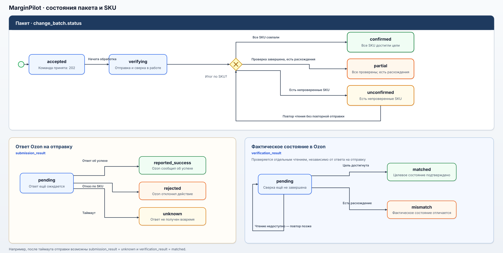

# HTTP-контракт MarginPilot — реконструкция

Контракт описывает обмен интерфейса с внутренним API MarginPilot. Сценарии цен, акций и план-факта соответствуют работавшему продукту; маршруты, JSON-поля и HTTP-коды восстановлены для кейса и не выдаются за исходную спецификацию. Примеры содержат вымышленные SKU и суммы. Вызовы 1С и Ozon относятся к интеграциям сервера и в этот контракт не входят.

Машиночитаемая версия контракта: [OpenAPI 3.1](../15-OPENAPI.json).

## 1. Общие правила

- Базовый путь: `/api/v1`.
- Доступ требует авторизованной сессии. Способ передачи сессии не реконструируется; закрепление менеджеров за DBS/FBO не превращается в систему ролей.
- Денежные значения в JSON передаются десятичными строками в рублях, например `"1290.00"`; даты — в формате `YYYY-MM-DD`, время — ISO 8601 с часовым поясом.
- Ответ на команду изменения не равен подтверждению результата в Ozon. Применённая цена и участие в акции проверяются сервером отдельно, автоматически.

## 2. Операции

| Метод и путь | Назначение | Успешный ответ |
| --- | --- | --- |
| `GET /api/v1/cabinets/{cabinet_id}/skus` | Список SKU для экрана оценки; поиск и постраничное чтение. | `200` |
| `POST /api/v1/cabinets/{cabinet_id}/evaluations` | Оценка экономики выбранных цен до отправки. | `200` |
| `POST /api/v1/cabinets/{cabinet_id}/price-batches` | Создать пакет цен и запустить его отправку в Ozon. | `202` |
| `POST /api/v1/cabinets/{cabinet_id}/promotion-batches` | Создать пакет изменений участия в акции и запустить его отправку в Ozon. | `202` |
| `GET /api/v1/batches/{batch_id}` | Состояние отправки и сверки по каждому SKU. | `200` |
| `GET /api/v1/cabinets/{cabinet_id}/skus/{seller_sku}/plan-fact` | План, факт и отклонение за период. | `200` |

Список SKU поддерживает поиск через `search`, `limit` (от 1 до 100, по умолчанию 50) и `cursor`; план-факт — обязательные `period_start` и `period_end`. `{cabinet_id}` — внутренний UUID кабинета, а не `ozon_client_id`. Приведённые пути и способ пагинации — часть реконструкции. Пример ответа на `GET /api/v1/cabinets/00000000-0000-4000-8000-000000000001/skus?limit=50`:

```json
{
  "items": [
    {
      "seller_sku": "SKU-DEMO-001",
      "name": "Товар для примера",
      "thumbnail_url": "https://example.com/demo/sku-001.jpg"
    }
  ],
  "next_cursor": null
}
```

## 3. Оценка экономики

`POST /api/v1/cabinets/{cabinet_id}/evaluations` принимает список SKU и рассматриваемое действие. Для обычной цены используется `proposed_price`, для входа в акцию — `promotion_id` и `promo_entry_price`. При выходе из акции новая цена не задаётся: прежнюю восстанавливает Ozon.

Пример запроса для обычных цен:

```json
{
  "action": "change_price",
  "items": [
    {"seller_sku": "SKU-DEMO-001", "proposed_price": "1290.00"},
    {"seller_sku": "SKU-DEMO-002", "proposed_price": "890.00"}
  ]
}
```

`200 OK` возвращает расчёт по каждому SKU, включая экономический порог и признак цены ниже него:

```json
{
  "items": [
    {
      "seller_sku": "SKU-DEMO-001",
      "economic_threshold": "1100.00",
      "planned_profit_per_unit": "90.00",
      "price_check": "allowed"
    },
    {
      "seller_sku": "SKU-DEMO-002",
      "economic_threshold": "1000.00",
      "planned_profit_per_unit": "-40.00",
      "price_check": "below_threshold"
    }
  ]
}
```

Цена ниже порога — предупреждение, не ошибка HTTP-запроса. Менеджер решает, включать ли такой SKU в итоговый пакет. Перед принятием команды сервер проверяет цену и порог заново; прежний результат оценки не служит разрешением на отправку.

## 4. Отправка пакета

Оба `POST`-запроса принимают только итоговый выбор менеджера. При нажатии «Отмена» запрос не выполняется. Заголовок `Idempotency-Key` обязателен: повтор с тем же ключом и тем же телом возвращает прежний `batch_id`, а не отправляет действие в Ozon второй раз. Для другого тела тот же ключ недопустим. Отсутствующий `include_below_threshold` трактуется как `false`.

Пример пакета цен, где менеджер отдельно подтвердил один SKU ниже порога:

```http
POST /api/v1/cabinets/00000000-0000-4000-8000-000000000001/price-batches
Idempotency-Key: demo-price-001
Content-Type: application/json
```

```json
{
  "items": [
    {"seller_sku": "SKU-DEMO-001", "proposed_price": "1290.00"},
    {
      "seller_sku": "SKU-DEMO-002",
      "proposed_price": "890.00",
      "include_below_threshold": true
    }
  ]
}
```

Для акции запрос содержит `action: "add_to_promotion"` или `"remove_from_promotion"`; каждый элемент указывает `seller_sku` и `promotion_id`. При добавлении обязательна отдельная `promo_entry_price`, при удалении она не передаётся. Подтверждение цены ниже порога применимо только к добавлению. Сервер сохраняет пользователя, время, кабинет, SKU и решение о таком подтверждении.

Пример тела запроса на добавление в акцию:

```json
{
  "action": "add_to_promotion",
  "items": [
    {
      "seller_sku": "SKU-DEMO-002",
      "promotion_id": "PROMO-DEMO-01",
      "promo_entry_price": "890.00",
      "include_below_threshold": true
    }
  ]
}
```

После проверки и сохранения пакета сервер отвечает `202 Accepted` и заголовком `Location: /api/v1/batches/{batch_id}`. Ниже — ответ для приведённого выше пакета цен из двух SKU:

```json
{
  "batch_id": "00000000-0000-4000-8000-000000000101",
  "status": "accepted",
  "accepted_items": 2
}
```

`202` означает, что MarginPilot принял команду в обработку, а не что Ozon уже применил изменение. Если пакет не удалось сохранить до отправки, команда не считается принятой и запрос к Ozon не выполняется. Это правило безопасности реконструированного контракта, а не подтверждение конкретной обработки сбоя PostgreSQL в исходной системе.

## 5. Результат по SKU

Интерфейс получает результат через `GET /api/v1/batches/{batch_id}`. Пока открыта страница результата и обработка пакета не завершена, интерфейс повторяет запрос автоматически; менеджеру не нужно вручную обновлять страницу или запускать сверку. Сверку с Ozon запускает сервер. `submission_result` отражает ответ на отправку, `verification_result` — фактическое состояние после отдельного чтения Ozon.

```json
{
  "batch_id": "00000000-0000-4000-8000-000000000101",
  "cabinet_id": "00000000-0000-4000-8000-000000000001",
  "action": "change_price",
  "status": "verifying",
  "items": [
    {
      "seller_sku": "SKU-DEMO-001",
      "submission_result": "reported_success",
      "verification_result": "matched",
      "target_price": "1290.00",
      "actual_price": "1290.00",
      "error": null
    },
    {
      "seller_sku": "SKU-DEMO-002",
      "submission_result": "rejected",
      "verification_result": "pending",
      "target_price": "890.00",
      "actual_price": null,
      "error": {"code": "OZON_REJECTED", "message": "Ozon отклонил изменение"}
    }
  ]
}
```

После завершения сверки тот же пакет может получить частичный результат: Ozon применил цену первого SKU, но отклонил второй. Код `200` означает лишь, что состояние пакета удалось прочитать.

```json
{
  "batch_id": "00000000-0000-4000-8000-000000000101",
  "cabinet_id": "00000000-0000-4000-8000-000000000001",
  "action": "change_price",
  "status": "partial",
  "items": [
    {
      "seller_sku": "SKU-DEMO-001",
      "submission_result": "reported_success",
      "verification_result": "matched",
      "target_price": "1290.00",
      "actual_price": "1290.00",
      "error": null
    },
    {
      "seller_sku": "SKU-DEMO-002",
      "submission_result": "rejected",
      "verification_result": "mismatch",
      "target_price": "890.00",
      "actual_price": "1090.00",
      "error": {"code": "OZON_REJECTED", "message": "Ozon отклонил изменение"}
    }
  ]
}
```

Для `submission_result` предусмотрены `pending`, `reported_success`, `rejected`, `unknown`; для `verification_result` — `matched`, `mismatch`, `pending`. `pending` означает, что ответ на отправку ещё ожидается; при таймауте результат становится `unknown`. В этом случае сервер читает актуальную цену или статус участия, повторяет неудавшееся чтение позже и **не повторяет отправку автоматически**. Частичный отказ Ozon возвращается в составе пакета, а не превращает уже выданный `202` в ошибку HTTP.

Состояние пакета `accepted` или `verifying` означает незавершённую обработку; `confirmed` — целевое состояние подтверждено для всех SKU; `partial` — проверка завершена, но не все SKU достигли цели; `unconfirmed` — результат хотя бы одного SKU пока не удалось выяснить.



[Открыть диаграмму в полном размере](../assets/state-batch-sku.svg). Диаграмма визуализирует реконструированный контракт, а не исходный код системы. `submission_result` и `verification_result` не образуют одну линейную цепочку: после таймаута отправки возможны `unknown` и одновременно `matched`, если отдельное чтение подтвердило целевое состояние. При `unconfirmed` повторяется чтение, но не отправка действия.

## 6. План-факт

`GET /api/v1/cabinets/{cabinet_id}/skus/{seller_sku}/plan-fact?period_start=2025-10-01&period_end=2025-10-31` возвращает суммы по выбранному SKU. Для каждой продажи план берётся из версии, действовавшей на момент продажи; фактические расходы учитываются за период отдельно.

```json
{
  "cabinet_id": "00000000-0000-4000-8000-000000000001",
  "seller_sku": "SKU-DEMO-001",
  "period_start": "2025-10-01",
  "period_end": "2025-10-31",
  "sold_units": 2,
  "planned_profit_total": "600.00",
  "actual_profit_total": "520.00",
  "profit_deviation_total": "-80.00",
  "profit_deviation_per_unit": "-40.00",
  "actual_expenses": [
    {"expense_type": "advertising", "amount": "120.00"}
  ]
}
```

Если продаж нет, фактические расходы остаются в ответе, а `profit_deviation_per_unit` равен `null`. Отклонение считается как `факт − план`.

## 7. Ошибки HTTP

HTTP-код относится к запросу **интерфейса к MarginPilot**. Отказ Ozon по отдельному SKU после принятия пакета — это результат элемента пакета, а не новый HTTP-ответ на исходный `POST`.

| Код | Случай | Заголовок |
| --- | --- | --- |
| `400` | Нечитаемый JSON или неверный формат параметра запроса. | Некорректный запрос |
| `401` | Нет авторизованной сессии. | Требуется авторизация |
| `404` | Не найден запрошенный кабинет, SKU или пакет. | Ресурс не найден |
| `409` | То же действие по SKU и акции ещё не завершено. | Действие уже выполняется |
| `409` | `Idempotency-Key` повторно использован с другим телом. | Ключ запроса уже использован |
| `422` | Итоговый пакет пуст. | SKU не выбраны |
| `422` | Значения в запросе не проходят бизнес-проверку. | Некорректные данные пакета |
| `422` | Не подтверждён SKU с ценой ниже порога. | Требуется подтверждение цены ниже порога |
| `500` | Внутренняя ошибка MarginPilot до принятия команды. | Внутренняя ошибка MarginPilot |
| `503` | Нужный внешний источник недоступен до принятия команды. | Внешний источник недоступен |
| `504` | Чтение внешнего источника до принятия команды завершилось таймаутом. | Нет ответа от внешнего источника |

`title` кратко называет тип ошибки и остаётся одинаковым для всех её повторений; детали конкретного запроса передаются в `detail`.

После ответа `202` сбой или таймаут Ozon отражается в состоянии пакета. Ошибки HTTP возвращаются в едином формате `application/problem+json`; ниже — пример реконструированного ответа на отсутствие подтверждения цены ниже порога:

```json
{
  "type": "urn:marginpilot:problem:threshold-confirmation-required",
  "title": "Требуется подтверждение цены ниже порога",
  "status": 422,
  "detail": "Подтвердите отправку выбранного SKU или исключите его из пакета.",
  "code": "THRESHOLD_CONFIRMATION_REQUIRED",
  "seller_skus": ["SKU-DEMO-002"]
}
```

Семантика HTTP-кодов опирается на [RFC 9110](https://www.rfc-editor.org/rfc/rfc9110.html), формат тела ошибки — на [RFC 9457](https://www.rfc-editor.org/rfc/rfc9457.html). Значения в таблице — проектный выбор для реконструкции, не свидетельство о кодах исходного API.
